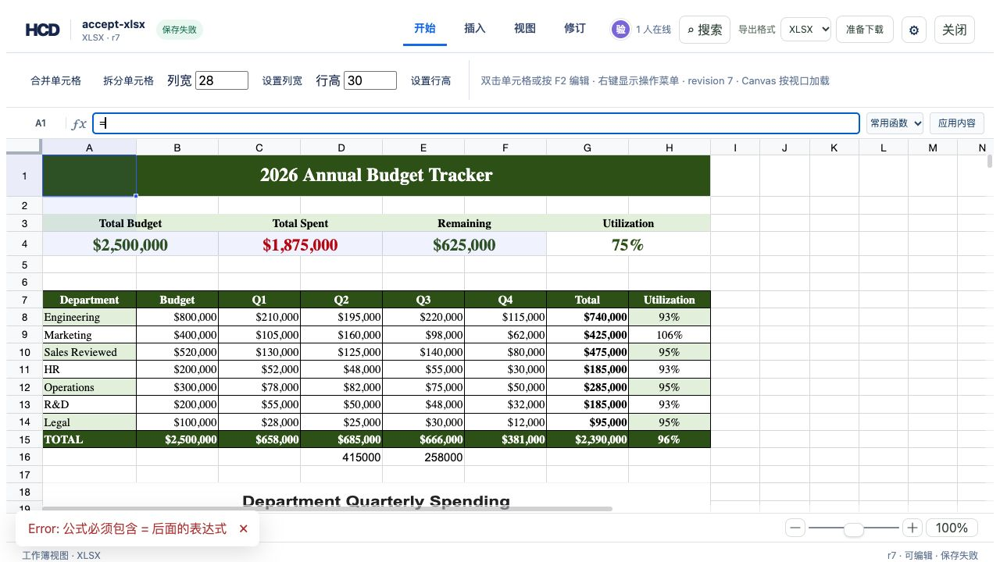

# Dismiss error notifications

The reference editor's error notification has a visible close button. Closing it clears the displayed error and leaves the document unchanged. The same component is used by the semantic, fixed-page, and XLSX views.

## Browser check

1. Open a writable XLSX HCD document in the reference editor.
2. Enter only `=` in the formula bar and press Enter.
3. Confirm the error notification has a button labelled `关闭错误提示`.
4. Click the button. Confirm the notification disappears and the HCD revision does not change.



## Build

```bash
cd examples/hdoc/editor
npm run build
```

Verified with `assets/showcase/budget-tracker.xlsx` imported into an isolated HCD bundle: the error appeared at revision 7, was dismissed, and revision 7 remained saved.
