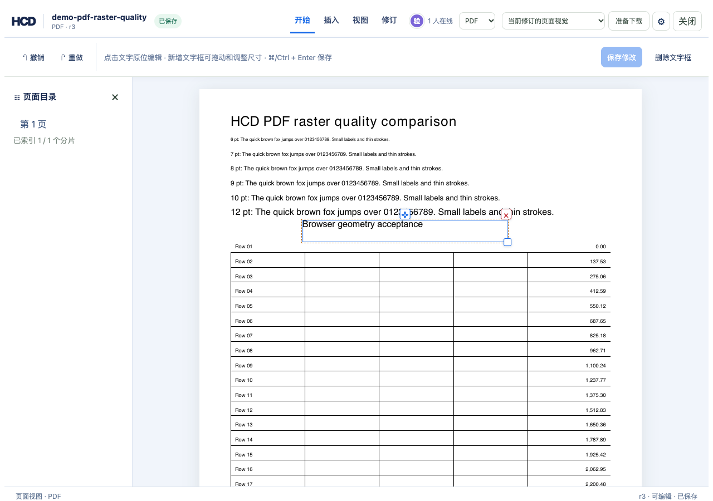
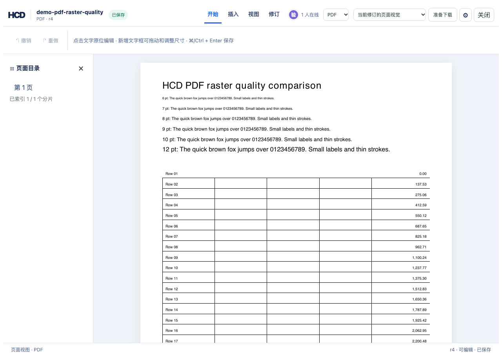

# PDF 新增文字框删除验收

`hcd-patch/24` 删除 HCD 新增的 PDF 文字框，并保留历史修订。原 PDF 的识别文字不接受此操作；如需清空识别文字，可将其内容编辑为空，但固定版式及源 PDF 的其他内容仍会保留。删除文字框时，指向该节点的 HCD annotation 一并从当前版本移除。

## 命令序列

在仓库根目录执行：

```bash
cargo build -p officecli
TASK_PDF_DELETE=$(mktemp -d)
SOURCE=examples/hdoc/pdf-raster-quality.pdf
BUNDLE="$TASK_PDF_DELETE/accept.hcd"
target/debug/officecli hdoc import "$SOURCE" \
  --output "$BUNDLE" --document-id accept-pdf-delete
python3 - "$TASK_PDF_DELETE" <<'PY'
import json, pathlib, sys
root = pathlib.Path(sys.argv[1])
insert = {'schemaVersion': 'hcd-patch/5', 'documentId': 'accept-pdf-delete',
          'patchId': 'insert-box', 'baseRevision': 0,
          'operations': [{'op': 'pdf.text.insert', 'page': 1, 'xPt': 60,
                          'yPt': 690, 'widthPt': 160, 'heightPt': 20,
                          'fontSizePt': 12, 'text': 'HCD removable box'}]}
(root / 'insert.json').write_text(json.dumps(insert))
PY
target/debug/officecli hdoc apply "$BUNDLE" \
  --patch "$TASK_PDF_DELETE/insert.json" --expected-revision 0
target/debug/officecli hdoc get-chunk "$BUNDLE" 0 --json > "$TASK_PDF_DELETE/r1.json"
python3 - "$TASK_PDF_DELETE" <<'PY'
import json, pathlib, sys
root = pathlib.Path(sys.argv[1])
data = json.loads((root / 'r1.json').read_text())['data']
node = next(entry for entry in data['map']['entries']
            if '/hcd-text[' in entry['source'].get('paragraphId', ''))
geometry = {'schemaVersion': 'hcd-patch/23', 'documentId': 'accept-pdf-delete',
            'patchId': 'move-box', 'baseRevision': 1,
            'operations': [{'op': 'pdf.text.geometry', 'nodeId': node['nodeId'],
                            'geometry': {'xPt': 98.25, 'yPt': 645.5,
                                         'widthPt': 220.5, 'heightPt': 30},
                            'precondition': {'nodeHash': node['nodeHash'],
                                             'geometry': {'xPt': 60, 'yPt': 690,
                                                          'widthPt': 160, 'heightPt': 20}}}]}
delete = {'schemaVersion': 'hcd-patch/24', 'documentId': 'accept-pdf-delete',
          'patchId': 'delete-box', 'baseRevision': 2,
          'operations': [{'op': 'pdf.text.delete', 'nodeId': node['nodeId'],
                          'precondition': {'nodeHash': node['nodeHash']}}]}
(root / 'move.json').write_text(json.dumps(geometry))
(root / 'delete.json').write_text(json.dumps(delete))
PY
target/debug/officecli hdoc apply "$BUNDLE" \
  --patch "$TASK_PDF_DELETE/move.json" --expected-revision 1
target/debug/officecli hdoc apply "$BUNDLE" \
  --patch "$TASK_PDF_DELETE/delete.json" --expected-revision 2
target/debug/officecli hdoc validate "$BUNDLE" --json
target/debug/officecli hdoc gc "$BUNDLE" --json
target/debug/officecli hdoc get-chunk "$BUNDLE" 0 --revision 2 --json > "$TASK_PDF_DELETE/r2.json"
target/debug/officecli hdoc get-chunk "$BUNDLE" 0 --revision 3 --json > "$TASK_PDF_DELETE/r3.json"
python3 - "$TASK_PDF_DELETE" <<'PY'
import json, pathlib, sys
root = pathlib.Path(sys.argv[1])
old = json.loads((root / 'r2.json').read_text())['data']
new = json.loads((root / 'r3.json').read_text())['data']
assert 'HCD removable box' in old['html']
assert 'HCD removable box' not in new['html']
assert sum('/hcd-text[' in entry['source'].get('paragraphId', '')
           for entry in new['map']['entries']) == 0
PY
target/debug/officecli hdoc export "$BUNDLE" --source "$SOURCE" \
  --output "$TASK_PDF_DELETE/source-backed.pdf"
cmp "$SOURCE" "$TASK_PDF_DELETE/source-backed.pdf"
target/debug/officecli hdoc export "$BUNDLE" \
  --output "$TASK_PDF_DELETE/semantic.pdf"
```

本地验证：删除后的 HCD r3 校验通过，r2 仍可读取文字框；`hdoc gc` 未把历史修订仍引用的对象列为孤儿。源文件导出与原 PDF 的 SHA-256 完全一致。额外验证了“修改源 PDF 文字后删除新增框”：其他文字修改保留，导出文本包含修改后的标题。错误的 node hash 和原 PDF 文字节点删除均被拒绝；带 annotation 的框删除后校验仍通过。只读令牌向 `/node-patch` 提交有效删除请求得到 HTTP 403。

## 页面验收

真实 PDF 的本地图库中选择 HCD 新增框，点击框右上角删除按钮后，页面从 r3 到 r4；关闭并重新打开后，该框不再出现，浏览器无页面异常。r3 历史版本仍包含文字框，r4 源文件导出与原 PDF 完全一致。




