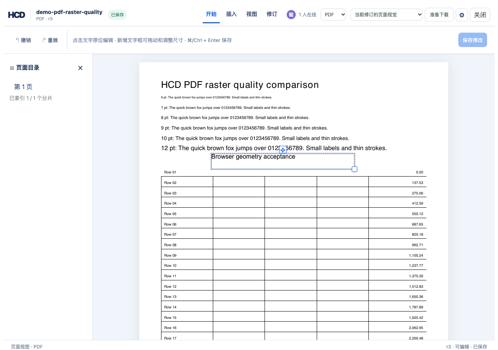

# PDF 新增文字框位置与尺寸验收

`hcd-patch/23` 只修改 HCD 新增的 PDF 文字框。页面内选择文字框后，拖动上方把手移动，拖动右下角把手调整尺寸。每次释放把手生成一个修订；原 PDF 的识别文字仍可原位改文字，但不能通过这个操作移动。PDF 导出仍使用近似字体和白色遮罩，原始 PDF 不被改写，视觉遮罩不构成脱敏。

## 可复现命令

在仓库根目录执行。样例是真实 PDF，导出后同时检查历史坐标、源文件导出和无源导出。

```bash
cargo build -p officecli
TASK_PDF_DIR=$(mktemp -d)
target/debug/officecli hdoc import examples/hdoc/pdf-raster-quality.pdf \
  --output "$TASK_PDF_DIR/accept.hcd" --document-id accept-pdf-geometry
python3 - "$TASK_PDF_DIR" <<'PY'
import json, pathlib, sys
root = pathlib.Path(sys.argv[1])
patch = {'schemaVersion': 'hcd-patch/5', 'documentId': 'accept-pdf-geometry',
         'patchId': 'pdf-insert-1', 'baseRevision': 0,
         'operations': [{'op': 'pdf.text.insert', 'page': 1, 'xPt': 60,
                         'yPt': 690, 'widthPt': 160, 'heightPt': 20,
                         'fontSizePt': 12, 'text': 'HCD movable text box'}]}
(root / 'insert.json').write_text(json.dumps(patch))
PY
target/debug/officecli hdoc apply "$TASK_PDF_DIR/accept.hcd" \
  --patch "$TASK_PDF_DIR/insert.json" --expected-revision 0
target/debug/officecli hdoc get-chunk "$TASK_PDF_DIR/accept.hcd" 0 --json > "$TASK_PDF_DIR/r1.json"
python3 - "$TASK_PDF_DIR" <<'PY'
import json, pathlib, sys
root = pathlib.Path(sys.argv[1])
data = json.loads((root / 'r1.json').read_text())['data']
node = next(item for item in data['map']['entries']
            if '/hcd-text[' in item['source'].get('paragraphId', ''))
patch = {'schemaVersion': 'hcd-patch/23', 'documentId': 'accept-pdf-geometry',
         'patchId': 'pdf-geometry-1', 'baseRevision': 1,
         'operations': [{'op': 'pdf.text.geometry', 'nodeId': node['nodeId'],
                         'geometry': {'xPt': 98.25, 'yPt': 645.5,
                                      'widthPt': 220.5, 'heightPt': 30},
                         'precondition': {'nodeHash': node['nodeHash'],
                                          'geometry': {'xPt': 60, 'yPt': 690,
                                                       'widthPt': 160, 'heightPt': 20}}}]}
(root / 'geometry.json').write_text(json.dumps(patch))
PY
target/debug/officecli hdoc apply "$TASK_PDF_DIR/accept.hcd" \
  --patch "$TASK_PDF_DIR/geometry.json" --expected-revision 1
target/debug/officecli hdoc validate "$TASK_PDF_DIR/accept.hcd" --json
target/debug/officecli hdoc get-chunk "$TASK_PDF_DIR/accept.hcd" 0 --revision 1 --json > "$TASK_PDF_DIR/history.json"
target/debug/officecli hdoc export "$TASK_PDF_DIR/accept.hcd" \
  --source examples/hdoc/pdf-raster-quality.pdf --output "$TASK_PDF_DIR/edited.pdf"
target/debug/officecli hdoc export "$TASK_PDF_DIR/accept.hcd" \
  --output "$TASK_PDF_DIR/semantic.pdf"
pdftotext -bbox "$TASK_PDF_DIR/edited.pdf" "$TASK_PDF_DIR/edited-bbox.html"
```

本次验证结果：修订 r1 的框坐标为 `(60, 690, 160, 20)` pt，r2 为 `(98.25, 645.5, 220.5, 30)` pt；原 nodeId 和文字 hash 保持不变。源文件导出中新增文字的首词 `HCD` 左边界为 `98.25` pt。源文件与无源导出的第一页渲染均在新位置显示文字。旧几何前置条件和原 PDF 文字节点作为几何目标均被拒绝。

## 页面验收

将同一 PDF 以 `demo-pdf-raster-quality` 导入本地图库后，执行“插入 → 新增文字框 → 输入 → 保存”，再次选中后拖动上方把手并调整右下角尺寸。浏览器从 r0 走到 r3，无页面异常；重新打开后新位置和尺寸保持。下图为重新打开后的 r3 选中态：


