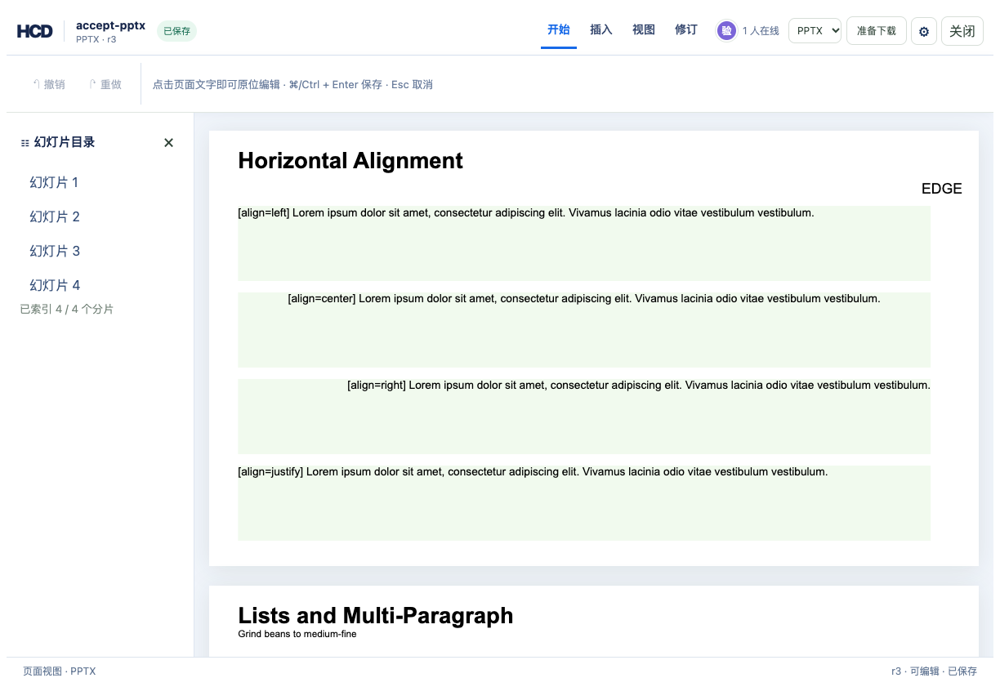
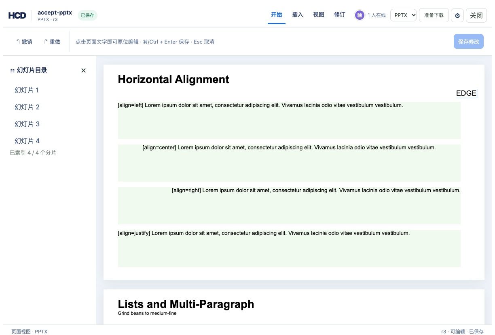

# PPTX 幻灯片适配视口验收

固定版式编辑页曾让 1280 px 幻灯片进入 942 px iframe，右侧约 338 px 被裁掉，点击层仍有 1280 px，导致右侧文字无法编辑。现在 iframe、点击层和新增文字框共用缩放后的画布；页面占位高度同步缩放，幻灯片之间不留下原尺寸空白。

## 复现命令

从仓库根目录执行，下列两个服务命令分别保持在终端运行。把第一个终端打印的临时目录填入第二个终端的 `TASK_PPTX_FIT`：

```bash
cargo build -p officecli
TASK_PPTX_FIT=$(mktemp -d)
printf '%s\n' "$TASK_PPTX_FIT"
mkdir -p "$TASK_PPTX_FIT/sources"
target/debug/officecli hdoc import examples/ppt/textboxes/textboxes-basic.pptx \
  --output "$TASK_PPTX_FIT/accept-pptx.hcd" --document-id accept-pptx
cp examples/ppt/textboxes/textboxes-basic.pptx \
  "$TASK_PPTX_FIT/sources/accept-pptx.pptx"
target/debug/officecli hdoc import examples/hdoc/pdf-raster-quality.pdf \
  --output "$TASK_PPTX_FIT/demo-pdf-raster-quality.hcd" \
  --document-id demo-pdf-raster-quality
HCD_TOKEN_SECRET='replace-with-a-private-secret-at-least-32-bytes' \
  target/debug/officecli hdoc serve --root "$TASK_PPTX_FIT" --bind 127.0.0.1:8776
```

```bash
TASK_PPTX_FIT=/tmp/把上一个终端输出的目录填在这里
cd examples/hdoc/editor
HCD_DEMO_ROOT="$TASK_PPTX_FIT" \
HCD_TOKEN_SECRET='replace-with-a-private-secret-at-least-32-bytes' \
HCD_API_TARGET=http://127.0.0.1:8776 \
  npm run dev -- --host 127.0.0.1 --port 8777
```

在 1224 × 830 浏览器窗口打开 `http://127.0.0.1:8777/`，选择 PPTX：画布、iframe 和点击层均为 942 px；源幻灯片仍为 1280 px，统一缩放为 0.735938。第一页可见宽度完整，下一页从 y=717 开始，第一页 y=160、高 533 px，中间仅有 24 px 页间距。隐藏左侧目录后缩放变为 0.915625，仍能点击文字。

在“插入”中点击第一页视觉右边缘、输入并保存，再次点选修改：新增文字框的视觉 x 与点击位置一致；修订 r3 的 HCD 校验通过，源文件导出的原生 PPTX 形状 x 为 11286013 EMU，文字为 `EDGE`。同一页面的 PDF 样例仍有 52 个文字点击区域，iframe、页面和点击层宽度相同，原位编辑可打开。




