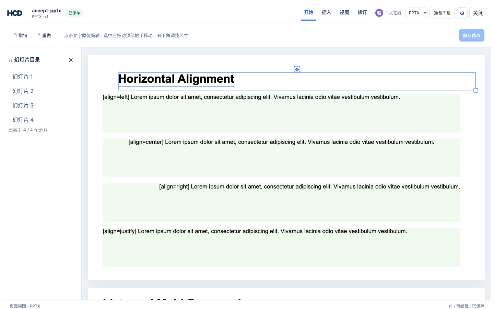
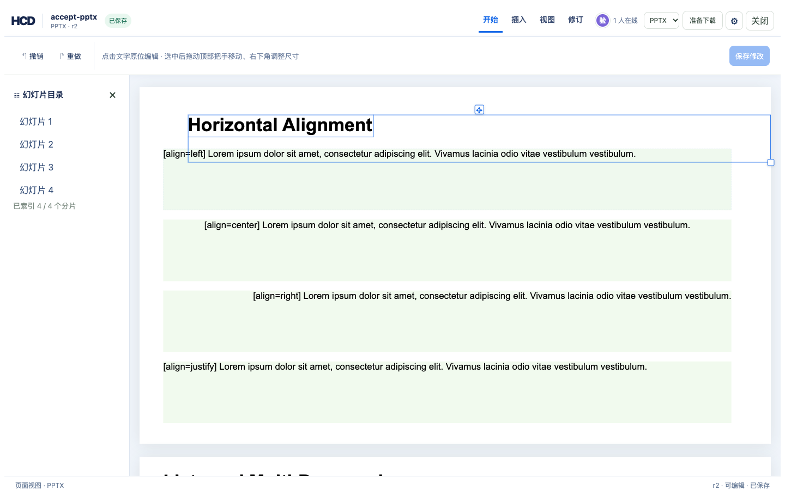

# PPTX 文字框移动与尺寸调整

参考编辑器选中可定位的 PPTX 文字框后，可拖动顶部把手移动，拖动右下角调整宽高。浏览器在幻灯片坐标中预览，松手后发送 `hcd-patch/17` 的 `pptx.shape.geometry`。补丁校验 revision、文字 nodeHash、旧 EMU 几何值和幻灯片边界。已有 nodeId 不变，旧 revision 不改写。原生 PPTX 导出修改目标 `<p:sp>` 的 `<a:off>` 与 `<a:ext>`，并保留它的旋转、文字格式与其他形状。新建的 HCD 文字框也可移动和调整尺寸。

## 验证命令

```bash
cargo fmt -- --check
cargo test -p hcd-core -p hcd-formats
cargo clippy -p hcd-core -p hcd-formats --all-targets -- -D warnings
(cd examples/hdoc/editor && npm run build)

cargo build -p officecli
mkdir -p /tmp/hcd-pptx-geometry-demo/sources
cp examples/ppt/textboxes/textboxes-basic.pptx /tmp/hcd-pptx-geometry-demo/sources/accept-pptx.pptx
target/debug/officecli hdoc import /tmp/hcd-pptx-geometry-demo/sources/accept-pptx.pptx \
  --output /tmp/hcd-pptx-geometry-demo/accept-pptx.hcd --document-id accept-pptx
target/debug/officecli hdoc validate /tmp/hcd-pptx-geometry-demo/accept-pptx.hcd
```

按 `examples/hdoc/editor/README.md` 启动核心 API 与 Vite，本地验收图库中选择“产品发布演示”，点击第一页标题文字，拖动顶部把手并拉伸右下角。每次松手应生成一个修订；重新打开后位置和尺寸应保持。用 `hdoc export BUNDLE --source SOURCE --output RESULT.pptx` 导出，再用 `hdoc import RESULT.pptx --output REIMPORT.hcd` 和 `hdoc validate REIMPORT.hcd` 检查。

实际运行中，第一页形状 `10000` 从 `off=(457200,274320), ext=(10972800,548640)` 更新到 `off=(930982,537532), ext=(11261018,917137)`；其余 4 个形状的坐标未变。导出的 27 个 ZIP 条目齐全，重新导入有效，浏览器无脚本错误。

| 选中并显示把手 | 移动、调整尺寸并重开后 |
| --- | --- |
|  |  |

**导出边界：** 固定版式应使用保存的原 PPTX 作 source-backed 导出。无源语义 PPTX 导出仍使用默认语义布局，保真报告会标记为 `SEMANTIC`；它不会复现本次物理坐标。
