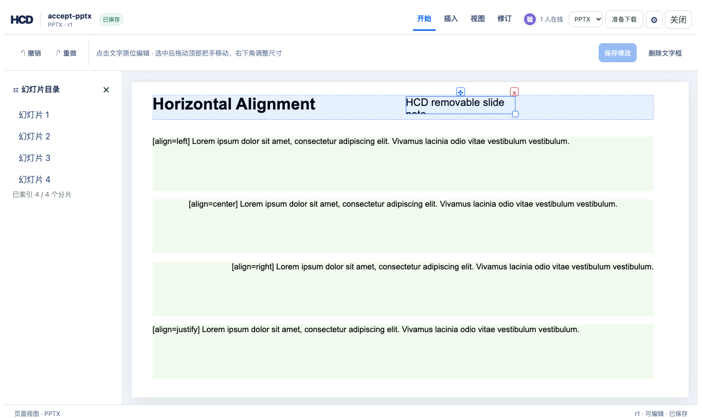
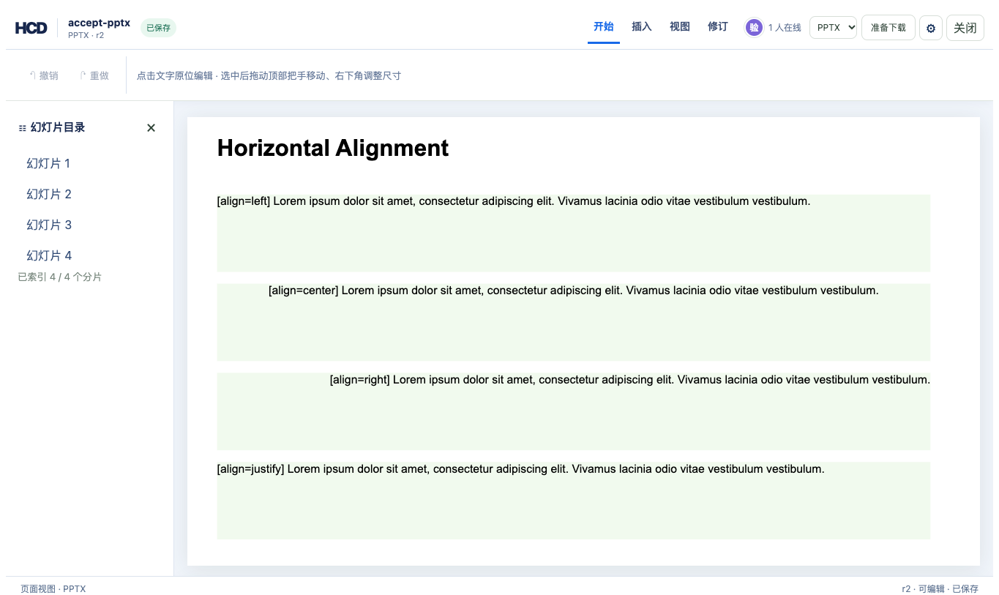

# PPTX 新增文字框删除验收

`hcd-patch/27` 删除 HCD 新增的 PPTX 文字框。原文件中的形状不能通过此操作删除。补丁校验当前 revision、节点 hash、source map 中的 `createdInHcd` 标记和页面中的文字框定位；删除后当前分片、source map 与 annotation 不再引用该节点，历史修订仍可读取。参考编辑器选中新增框后可用右上角 × 或工具栏“删除文字框”。

使用仓库内真实的 [`textboxes-basic.pptx`](../../examples/ppt/textboxes/textboxes-basic.pptx) 验证。命令从仓库根目录运行：

```bash
cargo build -p officecli
cargo test -p hcd-formats inserted_slide_text_box_is_valid_and_exports_as_native_shape
mkdir -p /tmp/hcd-pptx-delete-accept
target/debug/officecli hdoc import examples/ppt/textboxes/textboxes-basic.pptx \
  --output /tmp/hcd-pptx-delete-accept/accept.hcd --document-id accept-pptx-delete
python3 - <<'PY'
import gzip, json
from pathlib import Path
root = Path('/tmp/hcd-pptx-delete-accept'); bundle = root / 'accept.hcd'
manifest = json.loads((bundle / 'manifest.json').read_text())
def read(href):
    path = bundle / href
    with (gzip.open(path, 'rt') if path.suffix == '.gz' else path.open()) as stream:
        return json.load(stream)
chunk = read(read(manifest['indexRootHref'])['children'][0])['chunks'][0]
patch = {'schemaVersion': 'hcd-patch/16', 'documentId': 'accept-pptx-delete',
         'patchId': 'insert-r1', 'baseRevision': 0,
         'operations': [{'op': 'pptx.text.insert', 'chunkId': chunk['chunkId'],
                         'slidePart': 'ppt/slides/slide1.xml', 'xEmu': 6000000,
                         'yEmu': 300000, 'widthEmu': 2400000, 'heightEmu': 400000,
                         'fontSizePt': 18, 'text': 'HCD removable slide note'}]}
(root / 'insert.json').write_text(json.dumps(patch))
PY
target/debug/officecli hdoc apply /tmp/hcd-pptx-delete-accept/accept.hcd \
  --patch /tmp/hcd-pptx-delete-accept/insert.json --expected-revision 0
target/debug/officecli hdoc get-chunk /tmp/hcd-pptx-delete-accept/accept.hcd 0 \
  --json > /tmp/hcd-pptx-delete-accept/r1.json
python3 - <<'PY'
import json
from pathlib import Path
root = Path('/tmp/hcd-pptx-delete-accept')
entries = json.loads((root / 'r1.json').read_text())['data']['map']['entries']
native = next(entry for entry in entries if not entry['source'].get('createdInHcd'))
created = next(entry for entry in entries if entry['source'].get('createdInHcd'))
edit = {'schemaVersion': 'hcd-patch/1', 'documentId': 'accept-pptx-delete',
        'patchId': 'edit-native-r2', 'baseRevision': 1,
        'operations': [{'op': 'text.splice', 'nodeId': native['nodeId'], 'start': 0,
                        'deleteCount': 0, 'insertText': '[Reviewed] ',
                        'precondition': {'nodeHash': native['nodeHash']}}]}
delete = {'schemaVersion': 'hcd-patch/27', 'documentId': 'accept-pptx-delete',
          'patchId': 'delete-r3', 'baseRevision': 2,
          'operations': [{'op': 'pptx.text.delete', 'nodeId': created['nodeId'],
                          'precondition': {'nodeHash': created['nodeHash']}}]}
(root / 'edit.json').write_text(json.dumps(edit))
(root / 'delete.json').write_text(json.dumps(delete))
PY
target/debug/officecli hdoc apply /tmp/hcd-pptx-delete-accept/accept.hcd \
  --patch /tmp/hcd-pptx-delete-accept/edit.json --expected-revision 1
target/debug/officecli hdoc apply /tmp/hcd-pptx-delete-accept/accept.hcd \
  --patch /tmp/hcd-pptx-delete-accept/delete.json --expected-revision 2
target/debug/officecli hdoc validate /tmp/hcd-pptx-delete-accept/accept.hcd
for revision in 2 3; do
  target/debug/officecli hdoc export /tmp/hcd-pptx-delete-accept/accept.hcd \
    --revision "$revision" --source examples/ppt/textboxes/textboxes-basic.pptx \
    --output "/tmp/hcd-pptx-delete-accept/r$revision.pptx"
done
target/debug/officecli hdoc export /tmp/hcd-pptx-delete-accept/accept.hcd \
  --revision 3 --to pptx --output /tmp/hcd-pptx-delete-accept/semantic.pptx
python3 - <<'PY'
from zipfile import ZipFile
from pathlib import Path
root = Path('/tmp/hcd-pptx-delete-accept')
for revision in (2, 3):
    with ZipFile(root / f'r{revision}.pptx') as archive:
        slides = ''.join(archive.read(name).decode(errors='ignore') for name in archive.namelist()
                         if name.startswith('ppt/slides/slide') and name.endswith('.xml'))
        assert '[Reviewed] ' in slides
        assert ('HCD removable slide note' in slides) == (revision == 2)
with ZipFile(root / 'semantic.pptx') as archive:
    assert not any(b'HCD removable slide note' in archive.read(name)
                   for name in archive.namelist() if name.endswith('.xml'))
PY
```

实际结果：r2 的带源导出含原生新增形状，r3 不含该形状；另一处源 PPTX 文字修改仍在，四张幻灯片保持不变。无源语义 PPTX 导出也没有被删除的文字。单元测试还验证错误 hash、源文件原生形状删除均被拒绝，删除后带源导出可恢复原始部件内容。ZIP 容器头可能被重写，因此 `Exact` 保真报告不等于整个 `.pptx` 文件字节相同。

浏览器使用同一真实文件，在 r1 选中新增框，右上角出现删除按钮；点击后到 r2，关闭并重新打开后该框仍不存在。只读令牌向 `/node-patch` 提交删除请求返回 HTTP 403。该演示包 r2 带源导出为 `Exact`，27 个 PPTX 部件的解压后内容与源文件一致。




