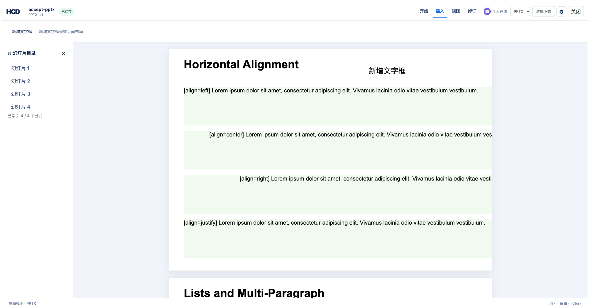
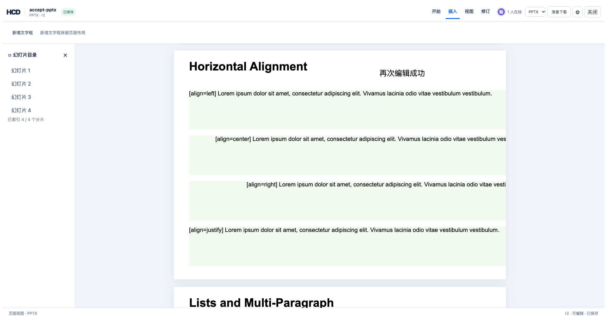

# PPTX 新增文字框验收

本变更在固定幻灯片上原位放置文字框，以 `hcd-patch/16` 保存为独立可编辑节点。源文件导出会追加原生 `<p:sp>` 形状；无源导出仍是语义重建，不能保留原幻灯片布局。

## 命令序列

从仓库根目录执行：

```bash
cargo build -p officecli
TASK_PPTX_DIR=$(mktemp -d)
target/debug/officecli hdoc import examples/ppt/textboxes/textboxes-basic.pptx \
  --output "$TASK_PPTX_DIR/accept-pptx.hcd" --document-id accept-pptx
target/debug/officecli hdoc get-index-page "$TASK_PPTX_DIR/accept-pptx.hcd" 0 --json \
  > "$TASK_PPTX_DIR/index.json"
python3 - "$TASK_PPTX_DIR" <<'PY'
import json, pathlib, sys
root = pathlib.Path(sys.argv[1])
chunk = json.loads((root / 'index.json').read_text())['data']['indexPage']['chunks'][0]
patch = {
    'schemaVersion': 'hcd-patch/16', 'documentId': 'accept-pptx',
    'patchId': 'accept-pptx-insert-1', 'baseRevision': 0,
    'operations': [{'op': 'pptx.text.insert', 'chunkId': chunk['chunkId'],
                    'slidePart': 'ppt/slides/slide1.xml', 'xEmu': 914400,
                    'yEmu': 5486400, 'widthEmu': 4572000, 'heightEmu': 457200,
                    'fontSizePt': 18, 'text': 'HCD 新增文字框 <&>'}]
}
(root / 'patch.json').write_text(json.dumps(patch, ensure_ascii=False))
PY
target/debug/officecli hdoc apply "$TASK_PPTX_DIR/accept-pptx.hcd" \
  --patch "$TASK_PPTX_DIR/patch.json" --expected-revision 0
target/debug/officecli hdoc validate "$TASK_PPTX_DIR/accept-pptx.hcd" --json
target/debug/officecli hdoc export "$TASK_PPTX_DIR/accept-pptx.hcd" \
  --source examples/ppt/textboxes/textboxes-basic.pptx \
  --output "$TASK_PPTX_DIR/edited.pptx"
python3 - "$TASK_PPTX_DIR/edited.pptx" <<'PY'
import sys, zipfile, xml.etree.ElementTree as ET
with zipfile.ZipFile(sys.argv[1]) as archive:
    slide = ET.fromstring(archive.read('ppt/slides/slide1.xml'))
ns = {'p': 'http://schemas.openxmlformats.org/presentationml/2006/main',
      'a': 'http://schemas.openxmlformats.org/drawingml/2006/main'}
assert len(slide.findall('.//p:sp', ns)) == 6
assert 'HCD 新增文字框 <&>' in [node.text for node in slide.findall('.//a:t', ns)]
PY
```

## 页面验收

用同一份 PPTX 启动 `hdoc serve` 和参考编辑器，进入“插入”后点击幻灯片空白处，原位输入并保存。再次点击该文字框，修改文本并保存；版本从 r0 到 r1、r2，下载的 PPTX 含一个原生新形状和 r2 文本。截图来自仓库样例 `examples/ppt/textboxes/textboxes-basic.pptx`：





本地浏览器验收：r2 的 HCD 校验通过，源文件导出为 `HIGH`，r0 源文件导出为 `EXACT`；浏览器“准备下载 → 下载文件”得到 `accept-pptx-r2.pptx`，其第一页有 6 个原生形状且新文字为“再次编辑成功”。
