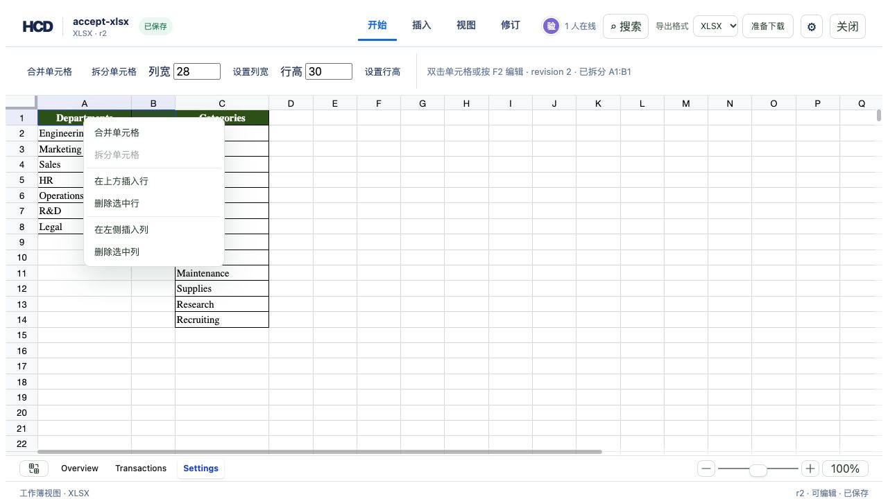

# XLSX worksheet right-click operations



Use `assets/showcase/budget-tracker.xlsx` and the reference editor described in `examples/hdoc/editor/README.md`:

```bash
cargo build -p officecli
mkdir -p /tmp/hcd-context-accept/sources
target/debug/officecli hdoc import assets/showcase/budget-tracker.xlsx \
  --output /tmp/hcd-context-accept/accept-xlsx.hcd --document-id accept-xlsx
cp assets/showcase/budget-tracker.xlsx /tmp/hcd-context-accept/sources/accept-xlsx.xlsx
# Start hdoc serve and the Vite gallery with HCD_DEMO_ROOT=/tmp/hcd-context-accept.
```

Open **Settings**, drag from A1 to B1, then right-click inside that selection. Choose **合并单元格**: the header advances to r1 and the visible A1:B1 range merges. Right-click A1 again and choose **拆分单元格**: the header advances to r2 and B1 becomes a separate empty cell. The right-click menu also exposes insert/delete row and column actions through the existing HCD patch handlers.

```bash
target/debug/officecli hdoc validate /tmp/hcd-context-accept/accept-xlsx.hcd
target/debug/officecli hdoc export /tmp/hcd-context-accept/accept-xlsx.hcd \
  --source assets/showcase/budget-tracker.xlsx --revision 1 --output /tmp/hcd-context-r1.xlsx
target/debug/officecli hdoc export /tmp/hcd-context-accept/accept-xlsx.hcd \
  --source assets/showcase/budget-tracker.xlsx --revision 2 --output /tmp/hcd-context-r2.xlsx
unzip -p /tmp/hcd-context-r1.xlsx xl/worksheets/sheet3.xml | rg 'mergeCell ref="A1:B1"'
! unzip -p /tmp/hcd-context-r2.xlsx xl/worksheets/sheet3.xml | rg 'mergeCell ref="A1:B1"'
```

Browser acceptance on the same workbook produced r1/r2 and the CLI confirmed that only historical r1 contains `mergeCell ref="A1:B1"`. The menu is only shown for writable sessions on the worksheet canvas. Server-side validation still rejects merges that would discard populated cells and writes made with a read-only token.
