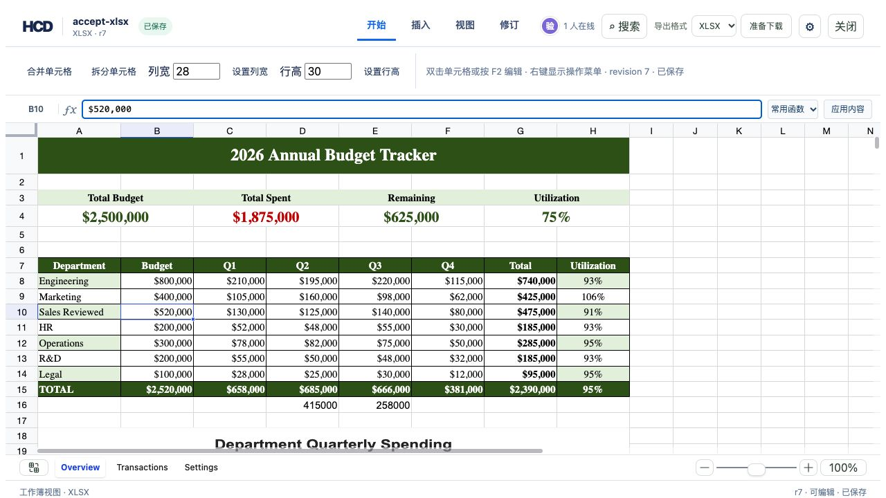

# XLSX formula bar accepts cell values

The formula bar now writes plain text, numbers (including displayed currency), and formulas through the same HCD cell-edit path as the grid. An unchanged field does not create a revision.

## Reproduce

Use `assets/showcase/budget-tracker.xlsx` as the source for a writable HCD document, then open it in the reference editor. In the `Overview` sheet:

1. Select `A10`, replace `Sales` with `Sales Reviewed` in the formula bar, and press Enter.
2. Select `B10`, replace `$500,000` with `$520,000`, and press Enter.
3. Select `E16`, enter `=SUM(D9:E9)`, and press Enter.
4. Confirm each edit creates one saved revision and the sheet shows the changed values. Reload the editor to check that the values persist.



## Validate export

```bash
officecli hdoc validate /path/to/accept-xlsx.hcd --json
officecli hdoc export /path/to/accept-xlsx.hcd \
  --source /path/to/budget-tracker.xlsx \
  --output /tmp/formula-bar-values.xlsx --json
python3 - <<'PY'
import openpyxl
w = openpyxl.load_workbook('/tmp/formula-bar-values.xlsx', data_only=False)
s = w['Overview']
assert s['A10'].value == 'Sales Reviewed'
assert s['B10'].value == 520000
assert s['E16'].value == '=SUM(D9:E9)'
assert len(s._charts) == 1
assert len(s.merged_cells.ranges) == 9
PY
```

The isolated acceptance bundle validated at revision 7 with no issues. The source-backed XLSX export retained numeric cell type, the formula, the chart, and all nine merged ranges. The export report notes that edited formula and chart caches require recalculation in a spreadsheet application.
