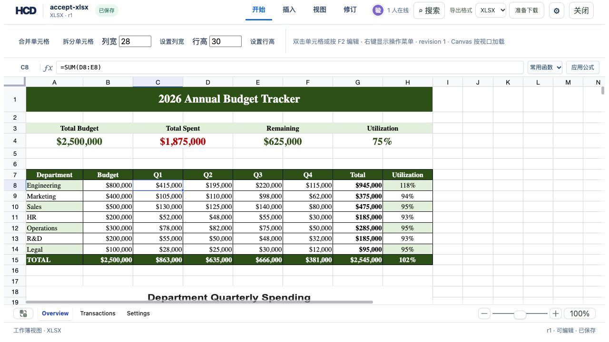

# XLSX formula input in existing cells

The reference editor now has a persistent formula bar above the grid. Select a cell, enter `=SUM(D8:E8)` and press Enter or **应用公式**. The function menu starts `SUM`, `AVERAGE`, `COUNT`, `MIN`, `MAX`, or `IF`; finish the arguments in the formula bar. Direct in-cell input and paste of `=...` also use the same HCD patch path. An existing editable numeric or text cell becomes a native Excel formula, keeping its node ID and earlier revisions. Existing ordinary formulas and empty cells keep their prior editing paths. Shared formulas that cannot be safely expanded and array formulas remain read-only.



## Reproduce with the real workbook

```bash
cargo build -p officecli
mkdir -p /tmp/hcd-xlsx-formula-repro/sources
target/debug/officecli hdoc import assets/showcase/budget-tracker.xlsx \
  --output /tmp/hcd-xlsx-formula-repro/accept-xlsx.hcd --document-id accept-xlsx
cp assets/showcase/budget-tracker.xlsx /tmp/hcd-xlsx-formula-repro/sources/accept-xlsx.xlsx
HCD_TOKEN_SECRET='use-the-same-local-secret-with-at-least-32-bytes' \
  target/debug/officecli hdoc serve --root /tmp/hcd-xlsx-formula-repro --bind 127.0.0.1:8862
```

In another terminal:

```bash
cd examples/hdoc/editor
HCD_DEMO_ROOT=/tmp/hcd-xlsx-formula-repro \
  HCD_TOKEN_SECRET='use-the-same-local-secret-with-at-least-32-bytes' \
  HCD_API_TARGET=http://127.0.0.1:8862 npm run dev -- --host 127.0.0.1 --port 8863
```

Open `http://127.0.0.1:8863/` and choose the XLSX card. Select **Overview!C8**, enter `=SUM(D8:E8)` in the formula bar, and apply. C8 changes from `$210,000` to `$415,000`, dependent G8 becomes `$945,000`, and the document advances to r1. Reopen the workbook: selecting C8 shows the formula in the bar and the calculated values remain visible. **准备下载 → 下载** yields `accept-xlsx-r1.xlsx`.

```bash
target/debug/officecli hdoc validate /tmp/hcd-xlsx-formula-repro/accept-xlsx.hcd --json
target/debug/officecli hdoc export /tmp/hcd-xlsx-formula-repro/accept-xlsx.hcd \
  --source /tmp/hcd-xlsx-formula-repro/sources/accept-xlsx.xlsx \
  --output /tmp/hcd-xlsx-formula-repro/formula-r1.xlsx
python3 - <<'PY'
from openpyxl import load_workbook
s = load_workbook('/tmp/hcd-xlsx-formula-repro/formula-r1.xlsx')['Overview']
assert s['C8'].value == '=SUM(D8:E8)'
assert s['G8'].value == '=SUM(C8:F8)'
assert len(s._charts) == 1
assert len(s.merged_cells.ranges) == 9
PY
```

The browser calculates common formulas using Univer. Source-backed export writes a native `<f>` element, clears the cached value, and requests recalculation when Excel opens the workbook. The HCD standalone HTML retains the formula expression; without the external XLSX source, semantic XLSX export still flattens formulas to text. Formula compatibility follows the supported Univer calculation functions and is not a promise of complete Excel function or external-link parity.
