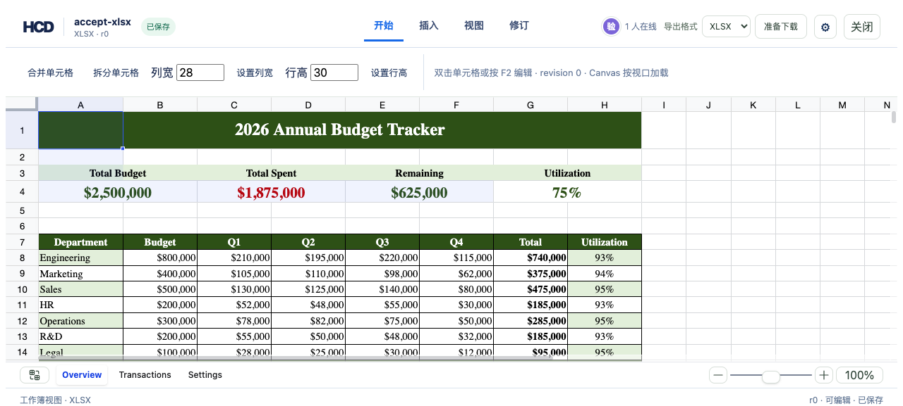
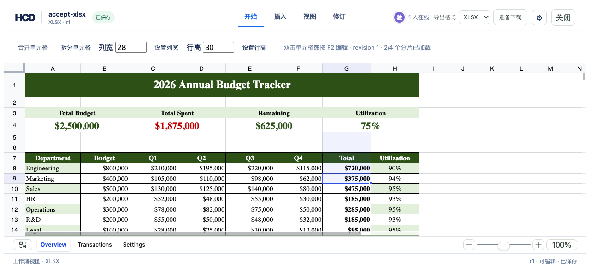

# XLSX native numeric editing

`hcd-patch/29` adds `xlsx.formula.to-number` and `xlsx.number.set`. Both keep the existing node ID, check the current revision and node hash, and write a finite numeric value to the HCD cell. Source-backed XLSX export writes a native `<v>` cell, expands an affected shared-formula group, and requests workbook recalculation. A later text edit clears the numeric marker and exports as text. One batch can combine numeric edits, formula-to-text conversion, and the existing cell edits.

The reference Univer editor captures the value entered before currency or percent formatting changes its display. It ignores later value-change events that only repeat the formatted display. Direct browser input, save, and browser download were checked with `assets/showcase/budget-tracker.xlsx`: Overview G8 changed from its formula result `$740,000` to the numeric value `720000`, while H8 recalculated to `90%`. The downloaded workbook has `G8.value == 720000`, `G8.data_type == 'n'`, and the H8 formula remains present.





## Reproduce with the CLI

```bash
cargo build -p officecli
cargo test -p hcd-formats converts_real_formula_to_native_number_then_text_without_stale_numeric_metadata
mkdir -p /tmp/hcd-number-accept
target/debug/officecli hdoc import assets/showcase/budget-tracker.xlsx \
  --output /tmp/hcd-number-accept/budget.hcd --document-id number-accept
python3 - <<'PY'
import gzip, json
from pathlib import Path
root = Path('/tmp/hcd-number-accept')
bundle = root / 'budget.hcd'
manifest = json.loads((bundle / 'manifest.json').read_text())
def read(href):
    path = bundle / href
    with (gzip.open(path, 'rt') if path.suffix == '.gz' else path.open()) as stream:
        return json.load(stream)
pages = read(read(manifest['indexRootHref'])['children'][0])
for chunk in pages['chunks']:
    if chunk['grid']['sheetName'] != 'Overview' or chunk['grid']['kind'] != 'cells':
        continue
    node = next((entry for entry in read(chunk['mapHref'])['entries']
                 if entry['source'].get('paragraphId') == 'G8'), None)
    if node:
        patch = {'schemaVersion': 'hcd-patch/29', 'documentId': 'number-accept',
                 'patchId': 'g8-native-number', 'baseRevision': 0,
                 'operations': [{'op': 'xlsx.formula.to-number',
                                 'nodeId': node['nodeId'], 'sheetId': chunk['grid']['sheetId'],
                                 'value': '720000',
                                 'precondition': {'nodeHash': node['nodeHash']}}]}
        (root / 'patch.json').write_text(json.dumps(patch))
        break
else:
    raise AssertionError('Overview G8 not found')
PY
target/debug/officecli hdoc apply /tmp/hcd-number-accept/budget.hcd \
  --patch /tmp/hcd-number-accept/patch.json --expected-revision 0
target/debug/officecli hdoc validate /tmp/hcd-number-accept/budget.hcd
target/debug/officecli hdoc export /tmp/hcd-number-accept/budget.hcd \
  --source assets/showcase/budget-tracker.xlsx \
  --output /tmp/hcd-number-accept/edited.xlsx
python3 - <<'PY'
from openpyxl import load_workbook
sheet = load_workbook('/tmp/hcd-number-accept/edited.xlsx')['Overview']
assert sheet['G8'].value == 720000 and sheet['G8'].data_type == 'n'
assert sheet['H8'].data_type == 'f'
PY
```

For browser acceptance, place the imported bundle at `<demo-root>/accept-xlsx.hcd`, copy its source to `<demo-root>/sources/accept-xlsx.xlsx`, run `hdoc serve` and the reference editor as described in `examples/hdoc/editor/README.md`, then type `720000` into Overview G8. **准备下载 → 下载** produces a native numeric G8. Editing that cell again with `710000` creates one further revision and keeps its numeric type.

The source-free semantic XLSX rebuild still flattens cell values to text; use source-backed export for native numeric types and existing workbook formatting. Numeric inputs outside JavaScript's safe integer range are rejected by the reference editor instead of silently rounding.
