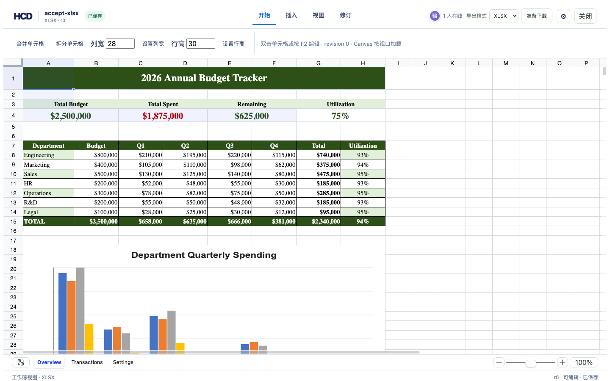
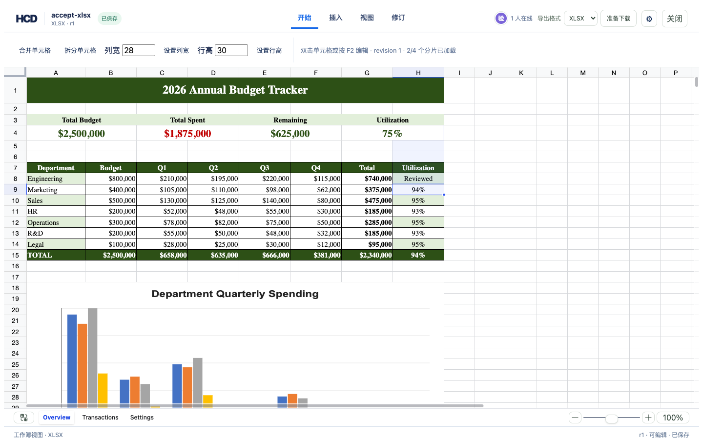

# XLSX 公式改为文字或清空验收

`hcd-patch/28` 允许将可编辑的 XLSX 公式格改为文字或空值，也可以和普通单元格修改一起作为一个修订提交。服务端核对 revision、nodeId、sheetId、节点 hash 和公式可编辑标记；转换后沿用原 nodeId，旧修订保持不变。带源导出写成原生 XLSX 文本格，并设置工作簿重新计算标志。共享公式组被修改时，其余成员展开为独立公式，避免留下指向已移除成员的共享组定义。

当前参考编辑器会恢复公式格中的数值输入，并提示“公式转数字需要保留数值类型”；本批只验收**文字与清空**。公式依赖项和图表缓存可能需要在 Excel 等应用中重新计算，保真报告会提示。

以下命令从仓库根目录运行，使用真实的 [`budget-tracker.xlsx`](../../assets/showcase/budget-tracker.xlsx)：

```bash
cargo build -p officecli
cargo test -p hcd-formats converts_real_shared_formulas_to_literal_values_and_keeps_history
cargo test -p hcd-formats creates_formula_in_blank_row_tail_and_exports_native_formula
export HCD_FORMULA_ACCEPT_DIR="$(mktemp -d /tmp/hcd-formula-to-value.XXXXXX)"
target/debug/officecli hdoc import assets/showcase/budget-tracker.xlsx \
  --output "$HCD_FORMULA_ACCEPT_DIR/budget.hcd" --document-id formula-to-value-accept
target/debug/officecli hdoc get-chunk "$HCD_FORMULA_ACCEPT_DIR/budget.hcd" 0 \
  --json > "$HCD_FORMULA_ACCEPT_DIR/overview-r0.json"
python3 - <<'PY'
import json, os
from pathlib import Path
root = Path(os.environ['HCD_FORMULA_ACCEPT_DIR'])
chunk = json.loads((root / 'overview-r0.json').read_text())['data']
node = next(entry for entry in chunk['map']['entries']
            if entry['source'].get('paragraphId') == 'H8')
patch = {'schemaVersion': 'hcd-patch/28', 'documentId': 'formula-to-value-accept',
         'patchId': 'review-h8', 'baseRevision': 0,
         'operations': [{'op': 'xlsx.formula.to-value', 'nodeId': node['nodeId'],
                         'sheetId': chunk['descriptor']['grid']['sheetId'],
                         'text': 'Reviewed',
                         'precondition': {'nodeHash': node['nodeHash']}}]}
(root / 'patch.json').write_text(json.dumps(patch))
PY
target/debug/officecli hdoc apply "$HCD_FORMULA_ACCEPT_DIR/budget.hcd" \
  --patch "$HCD_FORMULA_ACCEPT_DIR/patch.json" --expected-revision 0
target/debug/officecli hdoc validate "$HCD_FORMULA_ACCEPT_DIR/budget.hcd"
target/debug/officecli hdoc export "$HCD_FORMULA_ACCEPT_DIR/budget.hcd" \
  --source assets/showcase/budget-tracker.xlsx --output "$HCD_FORMULA_ACCEPT_DIR/r1.xlsx"
target/debug/officecli hdoc export "$HCD_FORMULA_ACCEPT_DIR/budget.hcd" \
  --revision 0 --source assets/showcase/budget-tracker.xlsx \
  --output "$HCD_FORMULA_ACCEPT_DIR/r0.xlsx"
python3 - <<'PY'
import os
from pathlib import Path
from zipfile import ZipFile
from openpyxl import load_workbook
root = Path(os.environ['HCD_FORMULA_ACCEPT_DIR'])
old = load_workbook(root / 'r0.xlsx')['Overview']['H8']
new = load_workbook(root / 'r1.xlsx')['Overview']['H8']
assert old.data_type == 'f' and old.value == '=G8/B8'
assert new.data_type == 's' and new.value == 'Reviewed'
with ZipFile(root / 'r1.xlsx') as archive:
    assert b'fullCalcOnLoad="1"' in archive.read('xl/workbook.xml')
print('r0 formula -> r1 text, workbook recalculation requested')
PY
```

实测：参考编辑器中点击 Overview 的 H8，直接输入 `Reviewed` 并回车，r0→r1，刷新后文字仍在；“准备下载”取得的 XLSX 由 openpyxl 正常打开，H8 为文字，r0 导出仍为公式。单元测试还覆盖真实工作簿共享公式主格与成员格的文字/空值混合转换、错误 hash、重复目标、nodeId 稳定、历史导出、剩余共享公式的展开，以及 HCD 新增公式转文字后的导出。数字输入会恢复原公式，修订号不增加。




