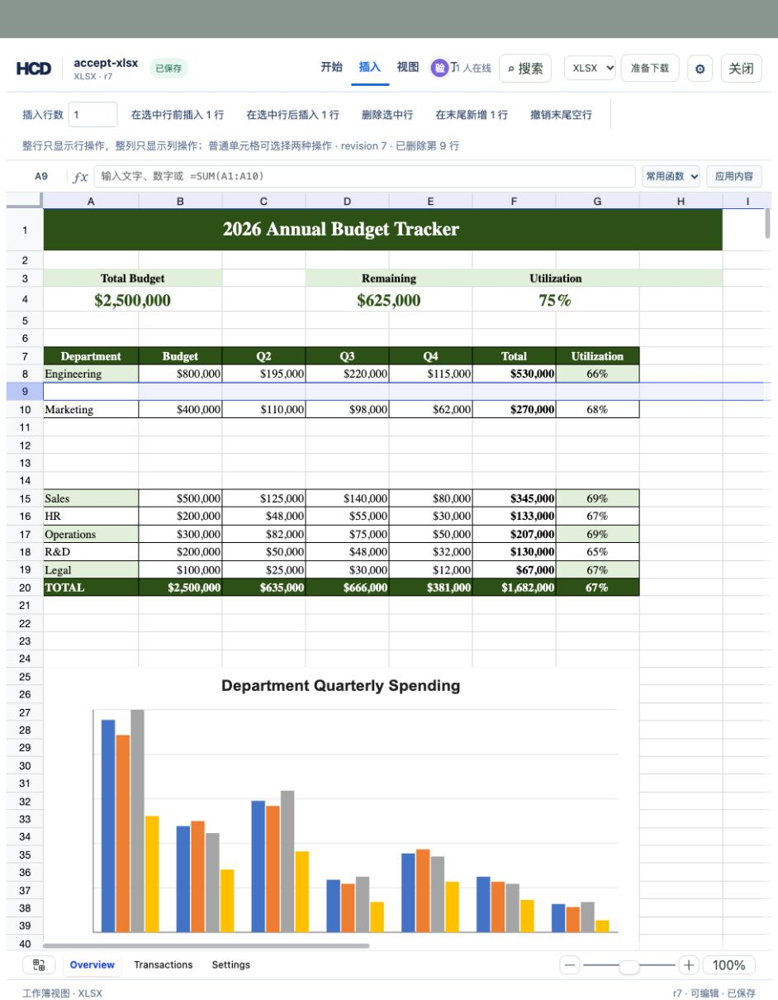

# XLSX 删除行列验收

原因：编辑器此前使用 `window.confirm`；在内嵌预览浏览器中，原生确认框会阻塞页面，删除请求无法提交。改为可取消的页面内确认框，删除成功后保持原选区坐标和滚动位置，不再调用 `focusCell`。

验收文件：`assets/showcase/budget-tracker.xlsx`，包含公式、合并单元格和图表。实际验收是在先执行多次插入的独立 HCD 副本 r4 上删除；从新导入的 r0 也可按同样步骤复现。



```bash
cargo build -p officecli
(cd examples/hdoc/editor && npm run build)
```

创建独立副本并启动服务（两个终端）：

```bash
mkdir -p /tmp/hcd-grid-delete-accept/sources
cp assets/showcase/budget-tracker.xlsx /tmp/hcd-grid-delete-accept/sources/accept-xlsx.xlsx
target/debug/officecli hdoc import assets/showcase/budget-tracker.xlsx \
  --output /tmp/hcd-grid-delete-accept/accept-xlsx.hcd --document-id accept-xlsx
HCD_TOKEN_SECRET='local-hcd-grid-delete-acceptance-secret-20260927' \
  target/debug/officecli hdoc serve --root /tmp/hcd-grid-delete-accept --bind 127.0.0.1:8922
```

```bash
cd examples/hdoc/editor
HCD_TOKEN_SECRET='local-hcd-grid-delete-acceptance-secret-20260927' \
  HCD_DEMO_ROOT=/tmp/hcd-grid-delete-accept HCD_API_TARGET=http://127.0.0.1:8922 \
  npm run dev -- --host 127.0.0.1 --port 8923 --strictPort
```

浏览器验收步骤（隔离副本，`http://127.0.0.1:8923/`）：

1. 打开「成绩册」，进入「插入」，点击行号 9，再点「删除选中行」。页面内显示「确认删除」。先点「取消」，修订不变。
2. 再次删除第 9 行并确认，原有数据上移一行。旧实现会把行选区改为单元格；修复后保留行选区。
3. 选中 C 列，确认删除；列选区仍停在 C，水平滚动位置未改变。公式显示值随删除重算。
4. 再选中第 9 行并确认删除；完整行选区仍停在第 9 行，垂直滚动位置未改变。

导出和校验命令：

```bash
target/debug/officecli hdoc validate /tmp/hcd-grid-delete-accept/accept-xlsx.hcd
target/debug/officecli hdoc export /tmp/hcd-grid-delete-accept/accept-xlsx.hcd \
  --source /tmp/hcd-grid-delete-accept/sources/accept-xlsx.xlsx \
  --output /tmp/hcd-grid-delete-accept/delete-r7.xlsx
python3 -c 'import zipfile; z=zipfile.ZipFile("/tmp/hcd-grid-delete-accept/delete-r7.xlsx"); print("charts", len([n for n in z.namelist() if n.startswith("xl/charts/chart") and n.endswith(".xml")])); print("formulas", sum(z.read(n).count(b"<f") for n in z.namelist() if n.startswith("xl/worksheets/sheet") and n.endswith(".xml")))'
```

实际验收结果：从 r4 起执行上述操作得到 r7，HCD 校验通过，XLSX 高保真导出；导出包保留 1 个图表与 25 个公式。历史 r4 仍可读取。
