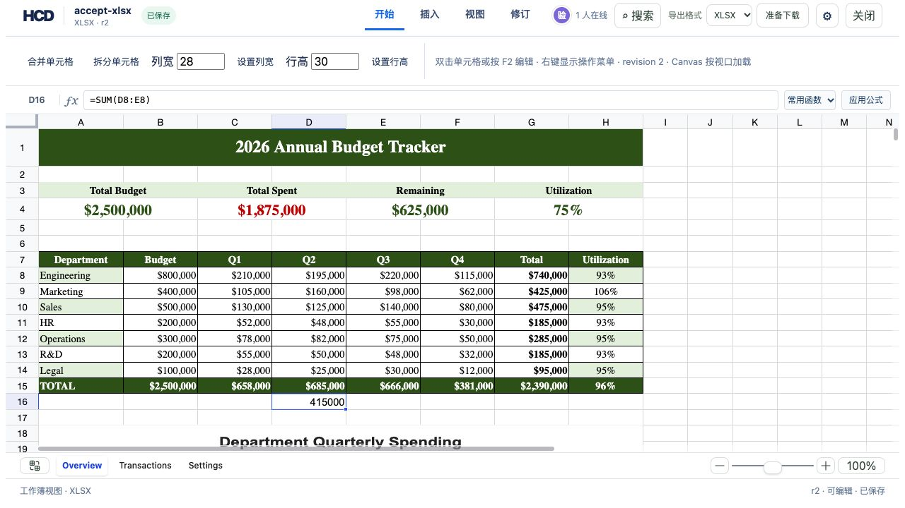

# XLSX 行内公式与末尾新行验收

在 `budget-tracker.xlsx` 的 Overview 工作表中，直接双击 D9 输入 `=SUM(E9:F9)` 并回车，D9 显示 `160000`，依赖它的 G9 显示 `425000`。双击原表格末尾的 D16 输入 `=SUM(D8:E8)` 并回车，D16 显示 `415000`。两次编辑分别生成一个 HCD 修订；重载页面后，选中 D16 时公式栏仍显示原表达式。截图取自重载后的 r2。



从仓库根目录复现：

```bash
cargo build -p officecli
cargo test -p hcd-formats creates_formula_in_first_row_after_grid_and_keeps_history
mkdir -p /tmp/hcd-xlsx-inline-formula/sources
cp assets/showcase/budget-tracker.xlsx /tmp/hcd-xlsx-inline-formula/sources/accept-xlsx.xlsx
target/debug/officecli hdoc import assets/showcase/budget-tracker.xlsx \
  --output /tmp/hcd-xlsx-inline-formula/accept-xlsx.hcd --document-id accept-xlsx
HCD_TOKEN_SECRET='local-inline-formula-secret-20260927-change-this' \
  target/debug/officecli hdoc serve --root /tmp/hcd-xlsx-inline-formula --bind 127.0.0.1:8872
```

另开终端：

```bash
cd examples/hdoc/editor
HCD_DEMO_ROOT=/tmp/hcd-xlsx-inline-formula \
HCD_TOKEN_SECRET='local-inline-formula-secret-20260927-change-this' \
HCD_API_TARGET=http://127.0.0.1:8872 \
  npm run dev -- --host 127.0.0.1 --port 8873
```

访问 `http://127.0.0.1:8873/` 并打开 XLSX 样例。完成两次行内编辑后：

```bash
target/debug/officecli hdoc validate /tmp/hcd-xlsx-inline-formula/accept-xlsx.hcd --json
target/debug/officecli hdoc export /tmp/hcd-xlsx-inline-formula/accept-xlsx.hcd \
  --source /tmp/hcd-xlsx-inline-formula/sources/accept-xlsx.xlsx \
  --output /tmp/hcd-xlsx-inline-formula/exported.xlsx
python3 - <<'PY'
from openpyxl import load_workbook
sheet = load_workbook('/tmp/hcd-xlsx-inline-formula/exported.xlsx')['Overview']
assert sheet['D9'].value == '=SUM(E9:F9)'
assert sheet['D16'].value == '=SUM(D8:E8)'
assert len(sheet._charts) == 1
assert len(sheet.merged_cells.ranges) == 9
PY
```

只允许在已有行或紧邻末尾的下一行创建单元格；跳过多行仍会被拒绝。浏览器显示计算值，XLSX 导出保留原生公式供 Excel 重新计算。
