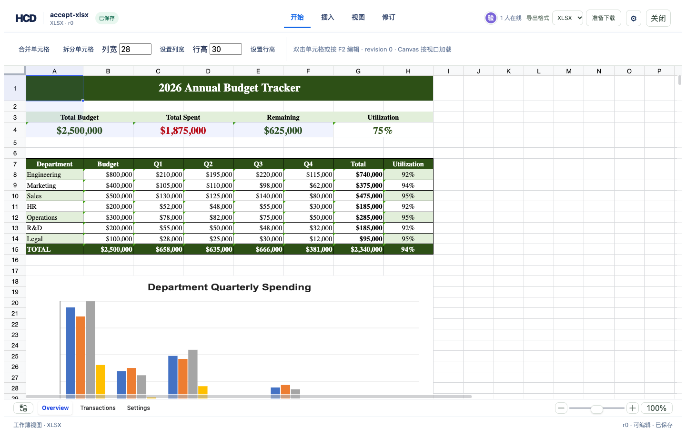
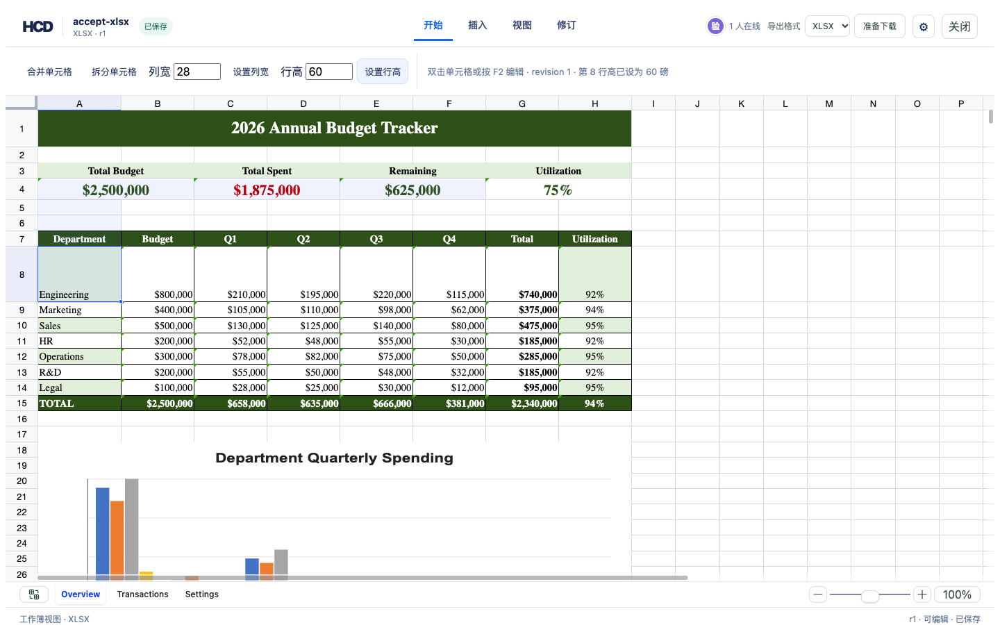

# XLSX 行高编辑验收

`开始 → 行高 → 设置行高` 使用 `hcd-patch/18`。HCD 更新选中行的页面高度；source-backed XLSX 导出写入目标 `<row ht="…" customHeight="1">`。原文件、历史 revision 和其他行不改写。隐藏行需要先显示后调整。

## 真实数据命令序列

```bash
cargo fmt -- --check
cargo test -p hcd-core -p hcd-formats
cargo clippy -p hcd-core -p hcd-formats --all-targets -- -D warnings
(cd examples/hdoc/editor && npm run build)
cargo build -p officecli
python3 - <<'PY'
import csv
from pathlib import Path
from openpyxl import Workbook
root=Path('/tmp/hcd-row-height-real'); root.mkdir(exist_ok=True)
workbook=Workbook(); sheet=workbook.active
with open('/Users/houshuai/Downloads/open-review-usage-2026-09.csv', encoding='utf-8-sig', newline='') as source:
    for row in csv.reader(source): sheet.append(row)
workbook.save(root/'source.xlsx')
PY
target/debug/officecli hdoc import /tmp/hcd-row-height-real/source.xlsx \
  --output /tmp/hcd-row-height-real/accept.hcd --document-id accept-xlsx
python3 - <<'PY'
import gzip,json
from pathlib import Path
root=Path('/tmp/hcd-row-height-real'); bundle=root/'accept.hcd'
manifest=json.loads((bundle/'manifest.json').read_text())
def read(name):
    with gzip.open(bundle/name,'rt') as source: return json.load(source)
sheet_id=read(read(manifest['indexRootHref'])['children'][0])['chunks'][0]['grid']['sheetId']
patch={'schemaVersion':'hcd-patch/18','documentId':'accept-xlsx','patchId':'real-row-height-r1',
       'baseRevision':0,'operations':[{'op':'xlsx.row.height','sheetId':sheet_id,'row':2,'heightPoints':48.5}]}
(root/'height.patch.json').write_text(json.dumps(patch))
PY
target/debug/officecli hdoc apply /tmp/hcd-row-height-real/accept.hcd \
  --patch /tmp/hcd-row-height-real/height.patch.json --expected-revision 0
target/debug/officecli hdoc validate /tmp/hcd-row-height-real/accept.hcd
target/debug/officecli hdoc export /tmp/hcd-row-height-real/accept.hcd \
  --source /tmp/hcd-row-height-real/source.xlsx --revision 1 \
  --output /tmp/hcd-row-height-real/edited.xlsx
target/debug/officecli hdoc export /tmp/hcd-row-height-real/accept.hcd \
  --source /tmp/hcd-row-height-real/source.xlsx --revision 0 \
  --output /tmp/hcd-row-height-real/original.xlsx
python3 - <<'PY'
from openpyxl import load_workbook
from pathlib import Path
root=Path('/tmp/hcd-row-height-real')
source=load_workbook(root/'source.xlsx').active
old=load_workbook(root/'original.xlsx').active
new=load_workbook(root/'edited.xlsx').active
assert list(source.values)==list(old.values)==list(new.values)
assert old.row_dimensions[2].height is None
assert new.row_dimensions[2].height==48.5
assert new.row_dimensions[1].height is None
assert new.row_dimensions[3].height is None
PY
```

## 浏览器与下载

公开样例可按以下命令启动；API 和 Vite 分别占用一个终端：

```bash
mkdir -p /tmp/hcd-row-height-demo/sources
cp assets/showcase/budget-tracker.xlsx /tmp/hcd-row-height-demo/sources/accept-xlsx.xlsx
target/debug/officecli hdoc import /tmp/hcd-row-height-demo/sources/accept-xlsx.xlsx \
  --output /tmp/hcd-row-height-demo/accept-xlsx.hcd --document-id accept-xlsx
HCD_TOKEN_SECRET='hcd-row-height-local-demo-2026-09-26-secret' \
  target/debug/officecli hdoc serve --root /tmp/hcd-row-height-demo --bind 127.0.0.1:8786
```

```bash
cd examples/hdoc/editor
HCD_DEMO_ROOT=/tmp/hcd-row-height-demo \
HCD_TOKEN_SECRET='hcd-row-height-local-demo-2026-09-26-secret' \
HCD_API_TARGET=http://127.0.0.1:8786 npm run dev -- --port 8787
```

将 `assets/showcase/budget-tracker.xlsx` 导入为图库 `accept-xlsx`，在 Overview 表选择 A8，输入行高 `60` 并点击 **设置行高**。界面从 r0 进入 r1，第 8 行约由 22 px 增为 80 px；重新打开后仍是 80 px。浏览器无脚本错误。点击 **准备下载 → 下载文件** 得到 `accept-xlsx-r1.xlsx`；`openpyxl` 确认 Overview 第 8 行为 60 磅，三个工作表的值和图表数量与源文件相同。

| 修改前 | 修改后 |
| --- | --- |
|  |  |

**导出边界：** source-backed XLSX 保留原工作簿结构；无源语义导出现在也保留 HCD 中显式设置的行高，但仍将工作表扁平化，保真级别为 `SEMANTIC`。公式、图形和冻结窗格的行列移动限制仍适用。
