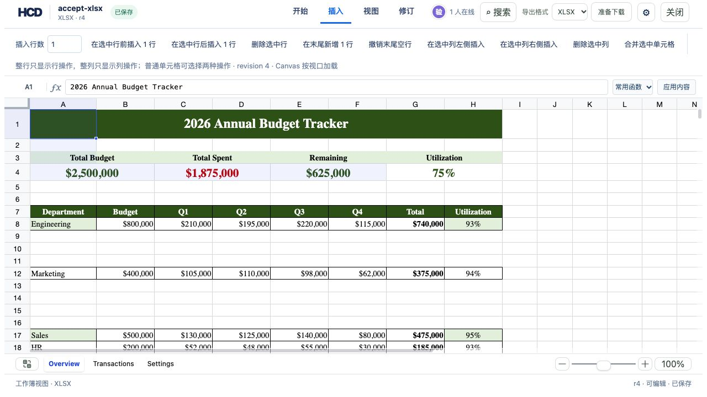

# XLSX 可选插入行数验收

使用 `assets/showcase/budget-tracker.xlsx`，其中包含公式、合并单元格及图表。编辑器的 **插入行数** 默认是 `1`，允许输入 `1–100` 的整数；顶部“上方插入”“下方插入”“末尾新增”和行右键菜单共用该数值。超出范围时插入按钮禁用。每次插入只生成一个 HCD revision，并保持当前选区及滚动位置。



```bash
cargo test -p hcd-formats xlsx::tests --lib
cargo fmt -- --check
cd examples/hdoc/editor && npm run build
```

命令行复现内部和末尾的批量插入：

```bash
mkdir -p /tmp/hcd-row-count-check
target/debug/officecli hdoc import assets/showcase/budget-tracker.xlsx \
  --output /tmp/hcd-row-count-check/budget.hcd --document-id budget-row-count
sheet_id=$(target/debug/officecli hdoc get-index-page /tmp/hcd-row-count-check/budget.hcd 0 --json \
  | jq -r '.data.indexPage.chunks[] | select(.grid.sheetName=="Overview") | .grid.sheetId' | head -1)
jq -n --arg sheetId "$sheet_id" '{schemaVersion:"hcd-patch/25",documentId:"budget-row-count",patchId:"insert-three-above-nine",baseRevision:0,actor:{},operations:[{op:"xlsx.grid.range",sheetId:$sheetId,axis:"row",action:"insert",start:9,count:3}],metadata:{}}' \
  > /tmp/hcd-row-count-check/three.json
target/debug/officecli hdoc apply /tmp/hcd-row-count-check/budget.hcd \
  --patch /tmp/hcd-row-count-check/three.json --expected-revision 0
jq -n --arg sheetId "$sheet_id" '{schemaVersion:"hcd-patch/25",documentId:"budget-row-count",patchId:"append-two-after-eighteen",baseRevision:1,actor:{},operations:[{op:"xlsx.grid.range",sheetId:$sheetId,axis:"row",action:"insert",start:19,count:2}],metadata:{}}' \
  > /tmp/hcd-row-count-check/tail.json
target/debug/officecli hdoc apply /tmp/hcd-row-count-check/budget.hcd \
  --patch /tmp/hcd-row-count-check/tail.json --expected-revision 1
target/debug/officecli hdoc validate /tmp/hcd-row-count-check/budget.hcd
target/debug/officecli hdoc export /tmp/hcd-row-count-check/budget.hcd \
  --source assets/showcase/budget-tracker.xlsx \
  --output /tmp/hcd-row-count-check/edited.xlsx
```

浏览器验收地址：`http://127.0.0.1:8913/`。真实预算表依次在第 9 行上方插入 3 行、在第 12 行下方插入 2 行、通过右键在第 15 行上方插入 2 行、在末尾新增 2 行，得到 r4。重新打开和源文件导出后，原有数据、公式和图表仍在；HCD 校验有效。右键菜单首次打开时也显示默认值 `1`。
