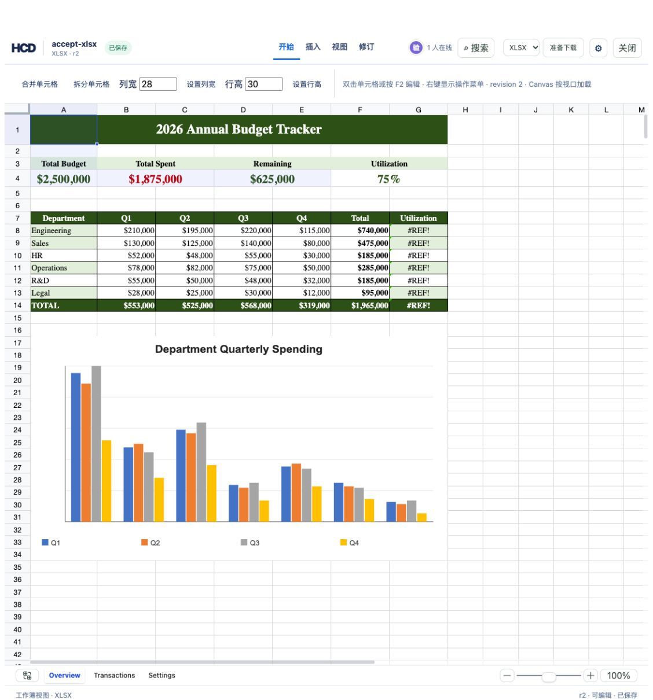

# XLSX row and column deletion with formulas and drawings

The right-click menu deletes rows and columns in `assets/showcase/budget-tracker.xlsx`. The source has shared formulas, nine merges, explicit column widths, conditional formatting, and a two-cell anchored chart. The original XLSX remains unchanged. HCD revisions retain the deleted data for history.



## Reproduce

```bash
cargo build -p officecli
mkdir -p /tmp/hcd-xlsx-structure-delete/sources
target/debug/officecli hdoc import assets/showcase/budget-tracker.xlsx \
  --output /tmp/hcd-xlsx-structure-delete/accept-xlsx.hcd --document-id accept-xlsx
cp assets/showcase/budget-tracker.xlsx /tmp/hcd-xlsx-structure-delete/sources/accept-xlsx.xlsx
HCD_TOKEN_SECRET='replace-with-a-private-random-secret-at-least-32-bytes' \
  target/debug/officecli hdoc serve --root /tmp/hcd-xlsx-structure-delete --bind 127.0.0.1:8852
```

In another terminal:

```bash
cd examples/hdoc/editor
HCD_DEMO_ROOT=/tmp/hcd-xlsx-structure-delete \
  HCD_TOKEN_SECRET='the-same-private-secret' \
  HCD_API_TARGET=http://127.0.0.1:8852 \
  npm run dev -- --host 127.0.0.1 --port 8853
```

Open `http://127.0.0.1:8853/`, open the XLSX card, right-click row 9 and choose **删除选中行**. Confirm the recoverable deletion. Then right-click column B and choose **删除选中列**. The header reaches r2. Marketing disappears, Sales moves to row 9, and Q1 moves into column B. Deleting the Budget column makes Utilization formulas display `#REF!` because their denominator was deleted; the formula cells themselves remain native Excel formulas.

```bash
target/debug/officecli hdoc validate /tmp/hcd-xlsx-structure-delete/accept-xlsx.hcd --json
target/debug/officecli hdoc export /tmp/hcd-xlsx-structure-delete/accept-xlsx.hcd \
  --source assets/showcase/budget-tracker.xlsx --revision 2 \
  --output /tmp/hcd-xlsx-structure-delete/edited-r2.xlsx
python3 - <<'PY'
from openpyxl import load_workbook
workbook = load_workbook('/tmp/hcd-xlsx-structure-delete/edited-r2.xlsx', data_only=False)
sheet = workbook['Overview']
assert sheet['F8'].value == '=SUM(B8:E8)'
assert sheet['G8'].value == '=F8/#REF!'
assert 'A1:G1' in sheet.merged_cells
assert sheet.column_dimensions['A'].width == 16
assert sheet.column_dimensions['B'].width == 14
assert len(sheet._charts) == 1
assert len(workbook.sheetnames) == 3
print('source-backed XLSX validated')
PY
```

The browser test created r1 and r2, `hdoc validate` returned `valid: true`, and source-backed export was reported as high fidelity. `openpyxl` reopened the exported file with three worksheets, one chart, shifted formulas, seven merges, explicit widths, and conditional formatting at `G8:G13`. The source-free `--to xlsx` path also exported r2 with semantic fidelity; use the source-backed export to retain the original chart and workbook-specific parts.
