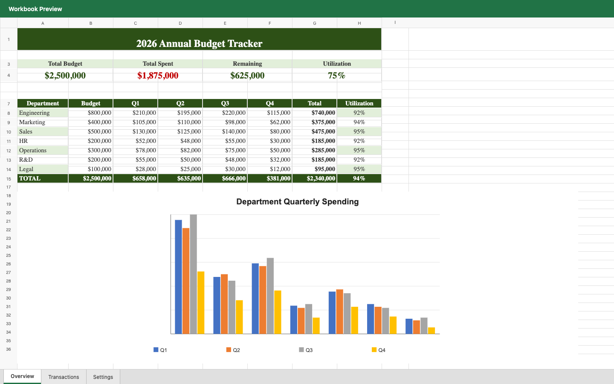
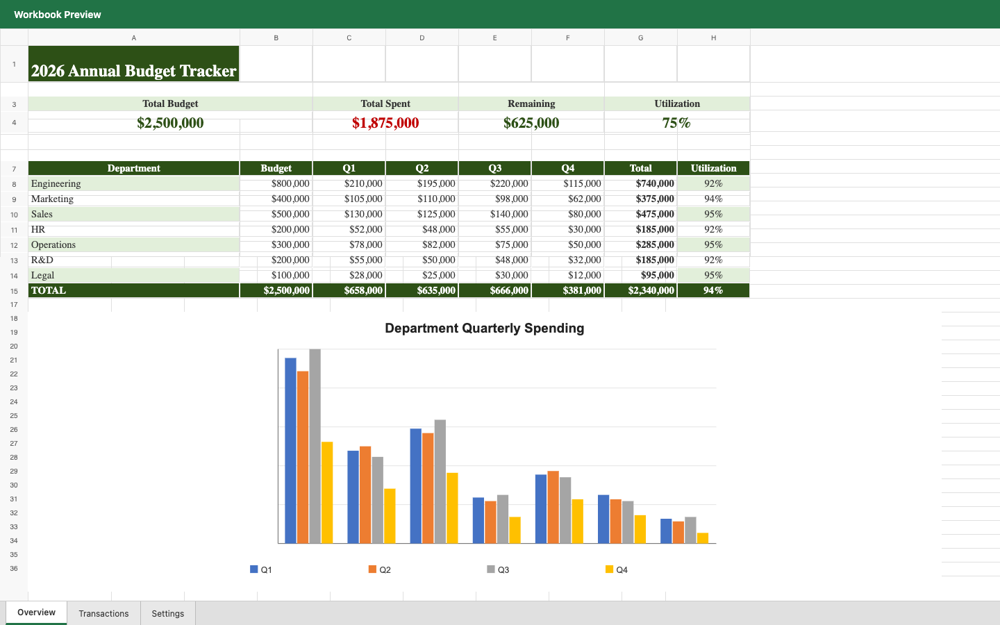

# 拆分从 XLSX 源文件导入的合并区域

`xlsx.unmerge` 现在可拆分源工作簿已有的合并区域。HCD 导入阶段会拒绝合并区域内含值或公式的覆盖单元格，因此拆分不会显露预览中遗漏的内容。原工作簿仍由外部保存；HCD 保留旧 revision，导出时仅重写发生网格结构变化的工作表。合并/拆分不会把未修改的锚点文字改写为内联字符串。

## 可复现验证

```bash
cargo fmt -- --check
cargo test -p hcd-formats xlsx::tests -- --nocapture
cargo clippy -p hcd-core -p hcd-formats --all-targets -- -D warnings
```

测试覆盖源合并区域与 HCD 新建合并区域的拆分、旧 revision、其他合并区域、带样式的空白覆盖单元格、源工作簿导出和 HCD 校验。测试夹具由 `xlsx::tests::create_shared_string_fixture` 在临时目录生成。

在实际工作簿 `accept-xlsx-r2.xlsx` 上，用 `hdoc import`、`hdoc extract-text`、`hdoc get-index-page`、`hdoc apply --expected-revision 0`、`hdoc validate`、`hdoc export --source` 和 `hdoc render-html --revision 0/1` 验证了 `A1:H1` 拆分。工作簿共有 9 个合并区域；导出后剩余 8 个，其他区域不变；`A1` 的原始单元格 XML 与样式、32 个 ZIP 部件均保持一致。

| 修订 0：原合并区域 | 修订 1：拆分后 |
| --- | --- |
|  |  |

截图为独立 HTML 预览。验收时还应通过参考编辑器选中源合并单元格，点击“拆分单元格”，再下载 XLSX 检查结果。
